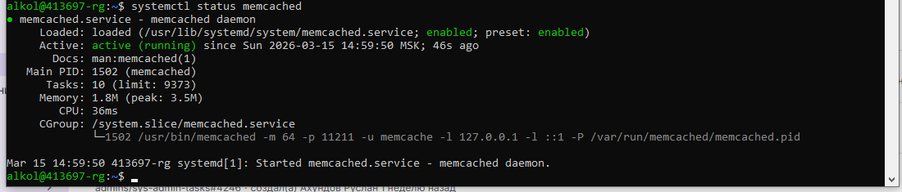
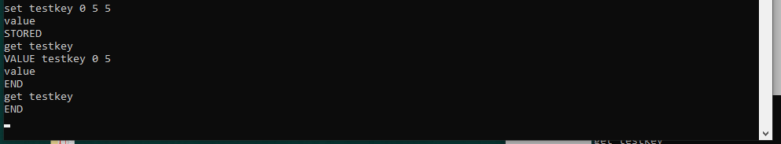

# Redis-memcached

## Задание 1. Кеширование

1. Медленная работа системы
Если каждый запрос требует сложных вычислений или обращения к базе данных, система начинает работать медленно. Кеширование позволяет сохранить результат и отдавать его сразу, без повторной обработки.

2. Высокая нагрузка на базу данных
При большом количестве пользователей база данных может перегружаться из-за частых одинаковых запросов. Кеш позволяет хранить популярные данные (например, список товаров или профили пользователей) и уменьшает количество обращений к БД.

3. Долгое получение данных из внешних сервисов
Если приложение обращается к сторонним API или удалённым сервисам, ответы могут приходить с задержкой. Сохраняя ответы в кеше, можно значительно ускорить последующие запросы.

4. Избыточные вычисления
Некоторые операции (например, генерация отчётов, обработка изображений, сложные расчёты) требуют много ресурсов. Если результат не меняется часто, его можно закешировать и использовать повторно.

5. Большая нагрузка на сервер при пиковом трафике
Во время резкого увеличения количества пользователей сервер может не справляться с обработкой всех запросов. Кеширование статических или редко меняющихся данных снижает нагрузку и помогает системе оставаться стабильной.

6. Медленная загрузка веб-страниц
Кеширование файлов (CSS, JavaScript, изображений) в браузере или на сервере позволяет быстрее загружать страницы, потому что данные не скачиваются заново при каждом открытии.

## Задание 2. Memcached
### Скриншот работы Memcashed

## Задание 3. Удаление по TTL в Memcached

### Скриншот работы удаления по TTL

## Задание 4. Запись данных в Redis

### Скриншот работы Redis

